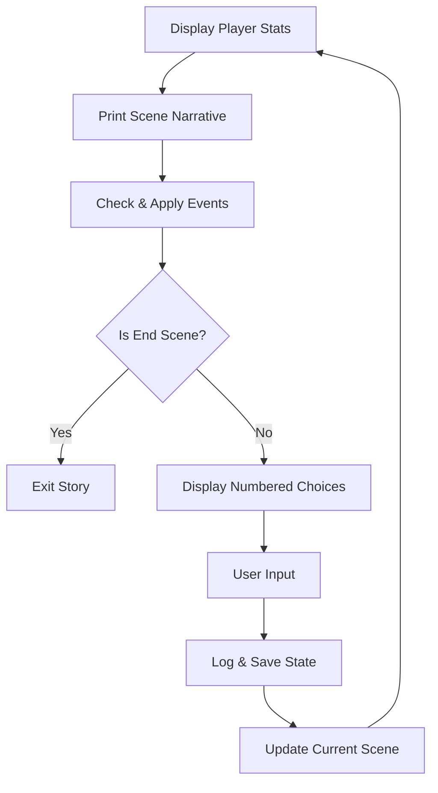

# Iron Skeleton: Visual Novel Engine

Iron Skeleton is a deterministic, data-driven **Visual Novel and Decision Tree engine** built in Python 3.10+. It serves as a robust "headless" core designed for Phase 2 integration with Large Language Models (LLMs), focusing on scene-based narrative flow, state serialization, and extensible event triggers.

## Project Structure

The codebase is organized into modular components, ensuring a clean separation between data definitions, narrative logic, and state persistence.

```text
HackMelb/
├── assets/themes/      # JSON-based story definitions (WasteLand, Cyberpunk, etc.)
├── logs/               # Human-readable session logs (.txt)
├── saves/              # Machine-readable state snapshots (.json)
├── engine.py           # Core narrative engine & scene transition logic
├── loader.py           # JSON validation and theme loading logic
├── main.py             # Entry point and interactive loop
├── models.py           # Data structures (Scenes, Options, Player, WorldState)
├── systems.py          # Event triggers, Logging, and Memory management
├── templates.py        # String templates for UI responses
└── world.py            # World state initialization helper
```

### Component Roles
- **`models.py`**: Uses Python dataclasses to define the core narrative entities (`Scene`, `Option`). It ensures type safety for the player state (HP, Mana, Bullets, Credits) and the narrative graph.
- **`loader.py`**: The `ThemeLoader` validates the integrity of the scene graph, ensuring no "broken" choice paths exist and raising clear errors for malformed JSON.
- **`systems.py`**: Houses the persistence layer. Includes `EventManager` for deterministic triggers, `NarrativeLogger` for human audits, and `MemoryManager` for AI-ready state snapshots.
- **`engine.py`**: The `GameEngine` manages scene transitions, applies event effects, and maintains the player's internal state.

### Engine Core Loop
The engine follows a strict narrative cycle:



---

## Theme Creation Guide

Iron Skeleton follows a "Content-First" philosophy. You can create a complete story by adding a folder to `assets/themes/` without editing any Python code.

### Step 1: Define the World (`world.json`)
This defines the narrative graph and starting stats.
```json
{
  "initial_scene_id": "intro",
  "player": { "hp": 100, "mana": 50, "bullet": 5, "credits": 50 },
  "scenes": {
    "intro": {
      "text": "You wake up in a desert.",
      "is_end": false,
      "options": [
        { "id": 1, "text": "Walk North", "next_scene_id": "oasis" },
        { "id": 2, "text": "Sleep", "next_scene_id": "game_over" }
      ]
    },
    "game_over": {
      "text": "You never woke up.",
      "is_end": true,
      "options": []
    }
  }
}
```

### Step 2: Set the Meta-Data (`story.json`)
```json
{
  "title": "WasteLand",
  "intro_text": "A world of magic and dust...",
  "winning_condition": "Find the Dragon Egg."
}
```

---

## The Event System

Events allow for mechanical consequences based on narrative progression. These are defined in `events.json`.

### Trigger Schema
- **`condition`**: The `scene_id` that triggers the event.
- **`probability`**: Chance of firing (e.g., `1.0` for 100%).
- **`narrative_description`**: Text displayed when the event occurs.
- **`result`**: Dictionary defining stat changes (e.g., `{"mana": 20, "hp": -10}`).

### Example `events.json`
```json
{
  "triggers": [
    {
      "event_id": "magical_well",
      "trigger_type": "scene_enter",
      "condition": "script_9_2",
      "probability": 1.0,
      "narrative_description": "You feel mana surging through you.",
      "result": { "mana": 20 }
    }
  ]
}
```

---

## State Management & Persistence

1.  **Narrative Log (`logs/session_*.txt`)**: A human-readable audit log. It records every scene description and every choice made by the player.
2.  **Memory Snapshot (`saves/memory.json`)**: A machine-readable snapshot updated every turn. It contains:
    - **`player_state`**: All current stats and inventory.
    - **`current_location`**: The active scene ID.
    - **`recent_history`**: A sliding window of the last 5 interactions.
    *Optimized for LLM context injection.*

---

## Running the Engine
To start a story:
```bash
python3 main.py WasteLand
```
*(Available themes: WasteLand, Cyberpunk, Default)*
