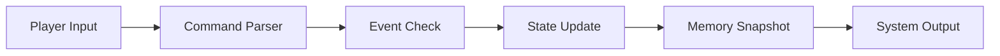

# Skeleton Engine

This is a deterministic, data-driven text-based RPG engine built in Python 3.10+. It serves as a "headless" core designed for future integration with Large Language Models (LLMs), focusing on robust state management, JSON-driven content loading, and an extensible event system.

## Project Structure

The codebase is organized into modular components, ensuring a clean separation between data definitions, logic, and state management.

```text
HackMelb/
├── assets/themes/      # JSON-based world definitions (Cyberpunk, Default, etc.)
├── logs/               # Human-readable session logs (.txt)
├── saves/              # Machine-readable state snapshots (.json)
├── engine.py           # Core Finite State Machine (FSM) & command processing
├── loader.py           # JSON validation and theme loading logic
├── main.py             # Entry point and REPL loop
├── models.py           # Data structures (Rooms, Items, Player, WorldState)
├── systems.py          # Event triggers, Logging, and Memory management
├── templates.py        # String templates for engine responses
└── world.py            # World state initialization helper
```

### Component Roles
- **`models.py`**: Uses Python dataclasses to define the core domain entities. It ensures type safety for the player state, inventory, and the spatial graph (Rooms).
- **`loader.py`**: The `ThemeLoader` class parses JSON files, validates the integrity of the world map (e.g., checking for broken exits), and initializes the world state.
- **`systems.py`**: Houses the "intelligence" systems. This includes the `EventManager` for logic triggers, `NarrativeLogger` for human audits, and `MemoryManager` for state persistence.
- **`engine.py`**: The `GameEngine` acts as the orchestrator. It maintains the current game mode (e.g., `EXPLORATION`) and maps player inputs to state changes.

### Engine Core Loop
The engine follows a deterministic cycle for every command processed:



---

## Theme Creation Guide

One of the core mandates of Iron Skeleton is a strict separation of code and content. You can create a completely new game by adding a new folder to `assets/themes/` without editing any Python code.

### Step 1: Create a Theme Folder
Create a directory in `assets/themes/[your_theme_name]`.

### Step 2: Define the World (`world.json`)
This file defines the map, rooms, and starting conditions.
```json
{
  "initial_room_id": "start_node",
  "player": { "hp": 100, "mana": 50, "bullet": 5, "credits": 50 },
  "rooms": {
    "start_node": {
      "name": "The Void",
      "description": "A silent white space.",
      "exits": { "north": "next_node" },
      "items": [{ "name": "Glass Shard", "description": "It's sharp." }]
    }
  }
}
```

### Step 3: Set the Narrative (`story.json`)
Defines the meta-information and victory conditions.
```json
{
  "title": "My Epic Quest",
  "intro_text": "Welcome to the adventure...",
  "winning_condition": "You found the Exit!"
}
```

---

## The Event System

The Event System allows for dynamic narrative moments and mechanical consequences based on player actions. These are defined in `events.json` as a list of `triggers`.

### Trigger Schema
A trigger consists of the following fields:

- **`trigger_type`**: The action that activates the event. Currently supported:
    - `enter_room`: Fires when the player moves into a specific room.
    - `take_item`: Fires when the player picks up a specific item.
- **`condition`**: The specific ID (room_id) or name (item_name) required to fire the event.
- **`probability`**: A float between `0.0` and `1.0` (e.g., `0.5` for a 50% chance).
- **`narrative_description`**: The text displayed to the player when the event fires.
- **`result_effect`**: A dictionary defining changes to the player's stats (e.g., `{"hp": -10, "mana": -5, "bullet": -1, "credits": 20}`).

### Example `events.json`
```json
{
  "triggers": [
    {
      "event_id": "trap_room_01",
      "trigger_type": "enter_room",
      "condition": "dark_alley",
      "probability": 1.0,
      "narrative_description": "You trip over a hidden wire! An alarm blares.",
      "result_effect": { "hp": -5, "mana": -10 }
    }
  ]
}
```

---

## State Management

Iron Skeleton maintains two distinct layers of state to serve different purposes:

1.  **History Log (`logs/session_*.txt`)**: An append-only, human-readable file. It captures every player command and every system response. This is used for debugging and reviewing play sessions.
2.  **Memory Snapshot (`saves/memory.json`)**: A machine-readable JSON file. It contains a "compressed" view of the current state, including:
    - Current Stats (HP, Mana, Bullets, Credits, Inventory).
    - Immediate Surroundings (Room name, exits, items).
    - Sliding window of the last 5 actions.
    *This file is specifically designed to be passed to an AI GM (Phase 2) as context.*

---

## Running the Engine
To start the engine with a specific theme:
```bash
python3 main.py [theme_name]
```
*(Default theme is 'cyberpunk')*
