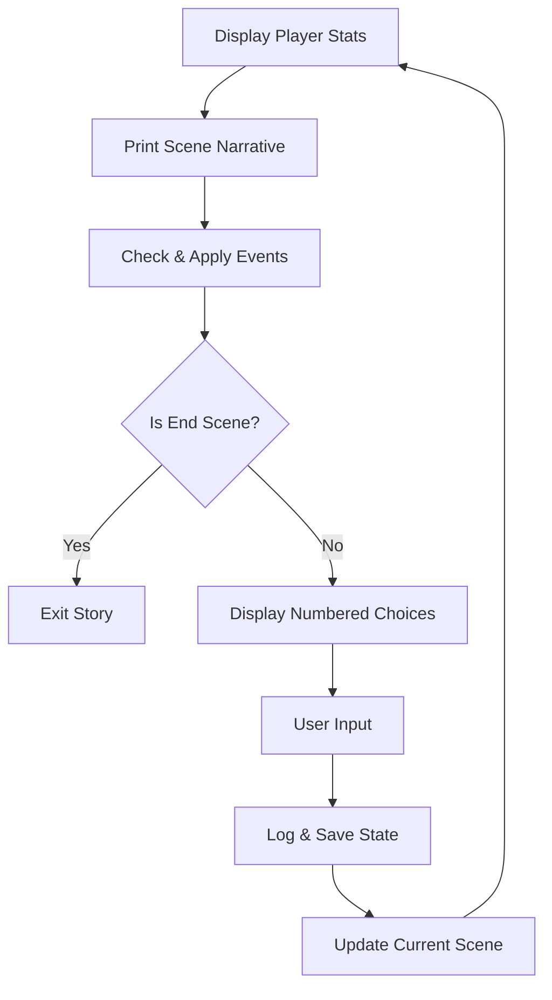

# Iron Skeleton: Visual Novel Engine

Iron Skeleton is a deterministic, data-driven **Visual Novel and Decision Tree engine** built in Python 3.10+. It serves as a robust "headless" core designed for Phase 2 integration with Large Language Models (LLMs), focusing on scene-based narrative flow, state serialization, and extensible event triggers.

## Project Structure

The codebase is organized into modular components, ensuring a clean separation between data definitions, narrative logic, and state persistence.

```text
HackMelb/
├── assets/themes/      # JSON-based story definitions (WasteLand, etc.)
├── logs/               # Human-readable session logs (.txt)
├── saves/              # Machine-readable state snapshots (.json)
├── engine.py           # Core narrative engine & scene transition logic
├── loader.py           # JSON validation and narrative/graph mapping
├── main.py             # Entry point and interactive loop
├── models.py           # Data structures (Scenes, Options, Player, WorldState)
├── systems.py          # Event triggers, Logging, and Memory management
├── templates.py        # String templates for UI responses
└── world.py            # World state initialization helper
```

### Component Roles
- **`models.py`**: Uses Python dataclasses to define core entities. `Scene` objects hold narrative text and decision options.
- **`loader.py`**: The `ThemeLoader` performs a cross-file lookup between `world.json` (the logic graph) and `story.json` (the narrative content). It ensures every logic node has corresponding story text.
- **`systems.py`**: Houses the persistence layer. Includes `EventManager` for deterministic triggers, `NarrativeLogger` for human audits, and `MemoryManager` for AI-ready state snapshots.
- **`engine.py`**: The `GameEngine` manages scene transitions, applies event effects, and maintains the player's internal state.

### Engine Core Loop
The engine follows a strict narrative cycle:



---

## Theme Creation Guide

Iron Skeleton separates **Logic** from **Content**. You can create a complete story by adding a folder to `assets/themes/` and defining the following files:

### Step 1: Define the Narrative (`story.json`)
This file contains the "scripts" or long-form text for your game, indexed by unique keys.
```json
{
  "title": "My Epic Quest",
  "intro_text": "Welcome to the adventure...",
  "scripts": {
    "start_scene_text": "You wake up in a cold, dark room...",
    "game_over_text": "The darkness consumes you."
  }
}
```

### Step 2: Define the Logic Graph (`world.json`)
This file defines how scenes connect. Instead of raw text, it uses `story_ref` to point to keys in `story.json`.
```json
{
  "initial_scene_id": "intro",
  "player": { "hp": 100, "mana": 50, "bullet": 5, "credits": 50 },
  "scenes": {
    "intro": {
      "story_ref": "start_scene_text",
      "is_end": false,
      "options": [
        { "id": 1, "text": "Open door", "next_scene_id": "hallway" }
      ]
    },
    "game_over": {
      "story_ref": "game_over_text",
      "is_end": true,
      "options": []
    }
  }
}
```

---

## The Event System

Events allow for mechanical consequences based on narrative progression. These are defined in `events.json`.

### Trigger Schema
- **`condition`**: The `scene_id` that triggers the event.
- **`probability`**: Chance of firing (e.g., `1.0` for 100%).
- **`narrative_description`**: Text displayed when the event occurs.
- **`result`**: Dictionary defining stat changes (e.g., `{"mana": 20, "hp": -10}`).

---

## State Management & Persistence

1.  **Narrative Log (`logs/session_*.txt`)**: A human-readable audit log. It records every scene description and every choice made by the player.
2.  **Memory Snapshot (`saves/memory.json`)**: A machine-readable snapshot updated every turn. Optimized for LLM context injection.

---

## Running the Engine
To start a story:
```bash
python3 main.py WasteLand
```
